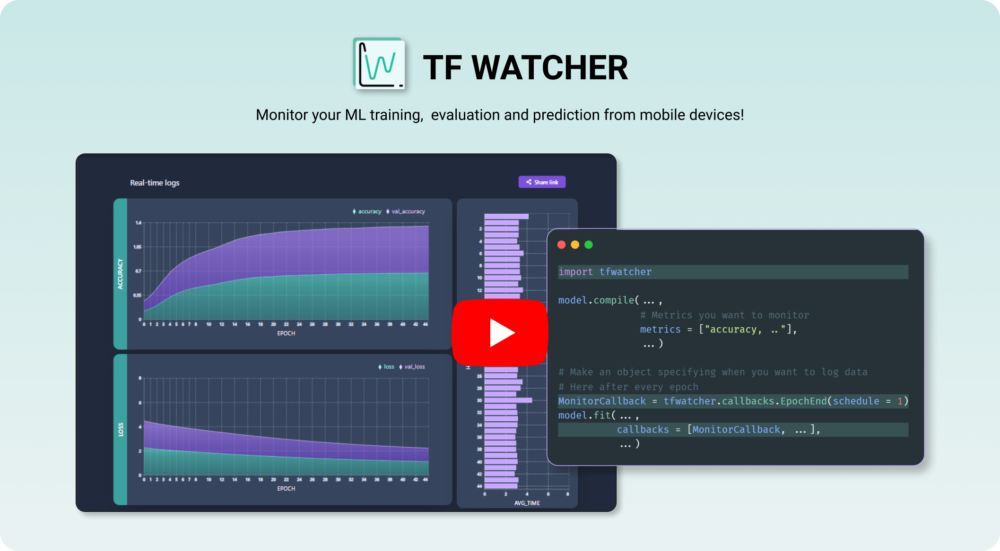

[](https://www.youtube.com/watch?v=jFYiZKQa6JQ)

# TF Watcher [](https://twitter.com/intent/tweet?text=Wow:&url=https%3A%2F%2Fgithub.com%2FRishit-dagli%2FTF-Watcher)

[](https://pypi.org/project/tf-watcher/)
[](https://github.com/Rishit-dagli/TF-Watcher/actions/workflows/tests.yml)
[](https://github.com/Rishit-dagli/TF-Watcher/actions/workflows/python-publish.yml)
[](https://github.com/Rishit-dagli/TF-Watcher/actions/workflows/sphinx-ci.yml)
[](https://github.com/Rishit-dagli/TF-Watcher/actions/workflows/linter.yml)

[](https://zenodo.org/badge/latestdoi/389973536)
[](LICENSE)
[](https://github.com/psf/black)
[](https://github.com/Rishit-dagli/TF-Watcher/stargazers)
[](https://github.com/Rishit-dagli/TF-Watcher/network/members)
[](https://github.com/Rishit-dagli/TF-Watcher/watchers)

**TF Watcher** is a simple to use Python package and web app which allows you to monitor 👀 your Machine Learning training or testing process on mobile devices 📱 built specially for Google Colab, Azure ML and Kaggle. Dedicated to all ML Developers with ❤️. 

## 📄 Project Documentation

[_**Visit the documentation of this project**_](https://rishit-dagli.github.io/TF-Watcher/) to get more information in detail.

## 💡 About the Project

This project includes two subprojects:

### 🔹 [TF Watcher Python Package](/tfwatcher)

This is a *Python Package* built using TensorFlow and Pyrebase (a python wrapper for the Firebase API). This allows to eaisly monitor the metrics you want and writes them to Firebase realtime database.

Navigate to [`/tfwatcher`](/tfwatcher) directory to browse and know more about the TF Watcher Python Package.

### 🔹 [TF Watcher Web App](/webapp)

This is a *Web Application* built using React, Chakra-UI, Recharts and Firebase deployed on Azure Static Web Apps. It reads from the Firebase realtime database and displays the logs using charts.

Navigate to [`/webapp`](/webapp) directory to browse and know more about TF Watcher Web App.

## Want to Contribute 🙋‍♂️?

Awesome! If you want to contribute to this project, you're always welcome! See [Contributing Guidelines](CONTRIBUTING.md). You can also take a look at [TF Watcher's Project Status Tracker](https://github.com/Rishit-dagli/TF-Watcher/projects/1) for getting more information about current or upcoming tasks.

## Want to discuss? 💬

Have any questions, doubts or want to present your opinions, views? You're always welcome. You can [start discussions](https://github.com/Rishit-dagli/TF-Watcher/discussions).

## Contributors

- [Rishit Dagli](https://github.com/Rishit-dagli)
- [Shreya Paradkar](https://github.com/shreyaparadkar)
- [Harsh Sharma](https://github.com/harshgeek4coder)

## License

```
Copyright 2020 Rishit Dagli

Licensed under the Apache License, Version 2.0 (the "License");
you may not use this file except in compliance with the License.
You may obtain a copy of the License at

    http://www.apache.org/licenses/LICENSE-2.0

Unless required by applicable law or agreed to in writing, software
distributed under the License is distributed on an "AS IS" BASIS,
WITHOUT WARRANTIES OR CONDITIONS OF ANY KIND, either express or implied.
See the License for the specific language governing permissions and
limitations under the License.
```